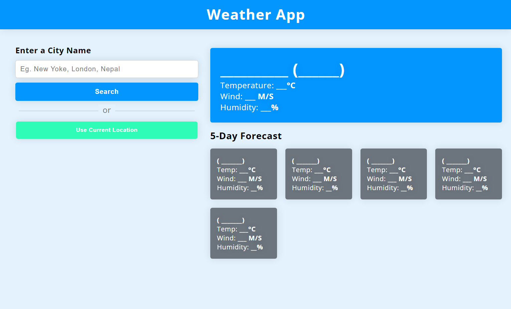

# PRODIGY_WD_05 (Weather App)

## Task - 5 Weather App

A simple weather application that fetches weather data from the OpenWeather API based on user input or current location. It displays current weather conditions, temperature, wind speed, and humidity, along with a 5-day forecast.



## Features

- Search for weather data by entering a city name.
- Display current weather conditions, temperature, wind speed, and humidity.
- Show a 5-day forecast with weather details.
- Use the "Use Current Location" button to fetch weather data based on your current location.
- Responsive design for various screen sizes.

## Technologies Used

- React
- Axios (for API requests)
- OpenWeatherMap API

## Getting Started

1. Clone the repository:

   ```sh
   git clone https://github.com/your-username/weather-app.git
   ```

2. Navigate to the project directory:

   ```sh
   cd weather-app
   ```

3. Install the dependencies

   ```sh
   npm install
   ```

4. Replace the ```API_KEY``` in the ```WeatherSearch.j```s file with your OpenWeatherMap API key.

5. Start the development server: ```npm run start```

6. The app will open in your default browser at ```http://localhost:3000```.

## Usage

- Enter a city name in the input field and click the "Search" button to get weather data for that city.

- Click the "Use Current Location" button to fetch weather data based on your current location.

## Challenges Faced

While building this weather application, I encountered several challenges, including:

- **Handling CORS** issues when making API requests from the browser.
- **Implementing responsive** design for different screen sizes.
- Parsing and formatting API data for display.
- Managing API keys securely.
- Implementing **error handling** for API requests and user inputs.

## Future Improvements

- Add more weather information, such as weather icons, sunrise/sunset times, and precipitation.
- Implement a more interactive user interface with animations and transitions.
- Improve error handling and user feedback.

## Credits

- OpenWeather API
- Fonts: Open Sans
